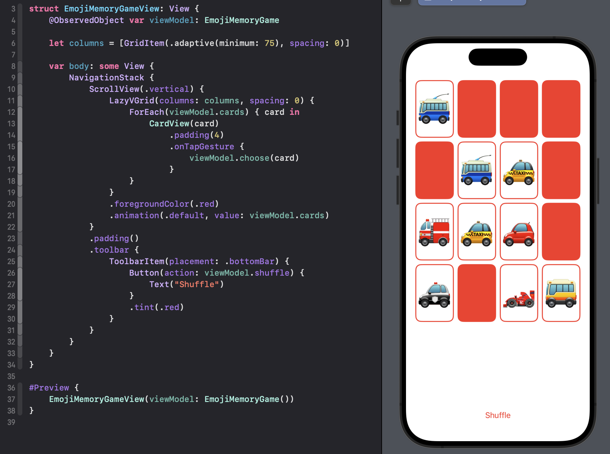

# Memorize Game :video_game:
###### Stanford University's course CS193p (Developing Applications for iOS using SwiftUI)

[TupleView](https://developer.apple.com/documentation/swiftui/tupleview)
[Code](https://github.com/obrienser/memorize)

